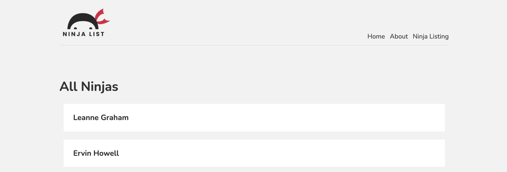

<h1 align="center">
  
   
  Next.js Tutorial
   
</h1>

  <a href="https://next-tutorial-net-ninja.vercel.app/" target="_blank">Demo</a> •
  <a href="https://nextjs.org/" target="_blank">Next.js</a> •
  <a href="https://www.youtube.com/watch?v=A63UxsQsEbU&list=PL4cUxeGkcC9g9gP2onazU5-2M-AzA8eBw" target="_blank">Next.js Tutorial</a> •
  <a href="https://www.youtube.com/channel/UCW5YeuERMmlnqo4oq8vwUpg" target="_blank">The Net Ninja</a>

## Tutorials

1. Introduction & Setup
1. Pages & Routes
1. Adding Other Components
1. Linking Between Pages
1. Creating a Layout Component
1. Adding Styles
1. Custom 404 Page
1. Redirecting Users
1. Images & Metadata
1. Fetching Data (getStaticProps)
1. Dynamic Routes (part 1)
1. Dynamic Routes (part 2 - getStaticPaths)
1. Fetching a Single Item
1. Deploying to Vercel
